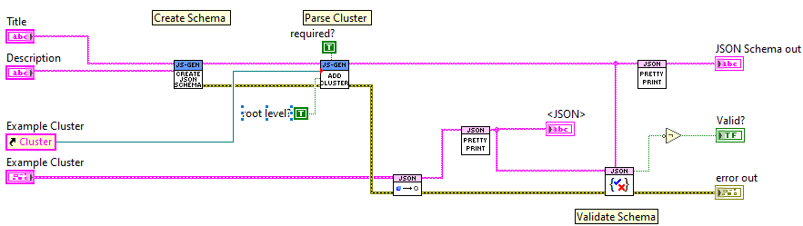
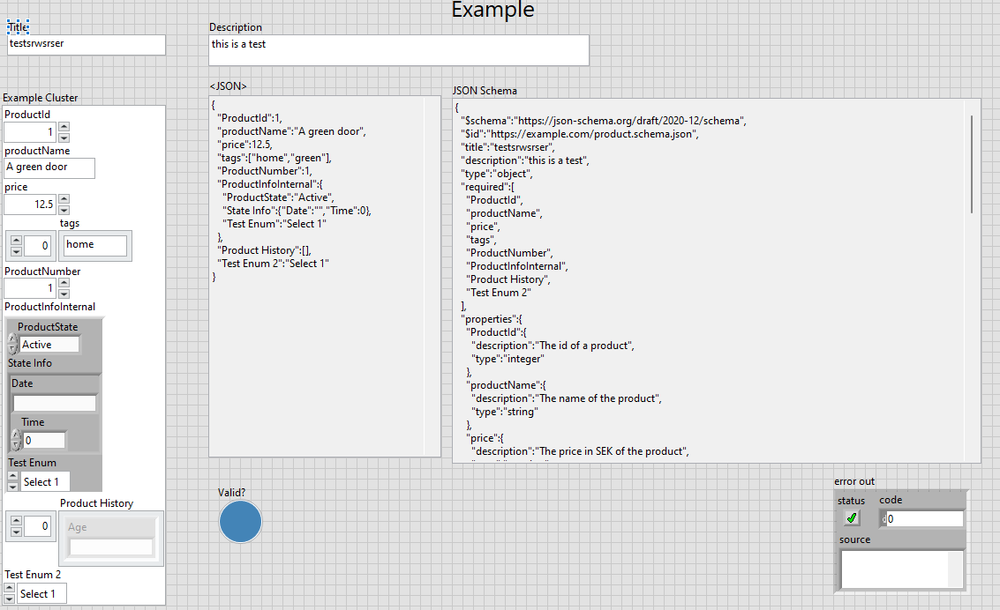

# LabVIEW JSON-Schema-Generator

[JSON Schema](https://json-schema.org/) is vocabulary which allows the definition of rules on how JSON data should be structured and validated. This allows for data consistancy, validation and interoperability between applications and languages. 

The LabVIEW JSON-Schema-Generator aims to extend the excellent JSONtext library by Dr. Powel by providing methods to generate a JSON Schema based of LabVIEW datatypes. The JSONtext library provides all common operations to handle JSON data as well as a validator against a JSON Schema. 

The current code base was developed based on internal requirements but has been open-sourced with the intention to develop a general tool to create JSON Schemas with LabVIEW.

Example:

## Scope

State: Work in Progress

The current implementation has the asumption that the root level of the JSON Schema is generated based on a cluster. Differnet properties of an control in the cluster are added to the Schema. Standards are the name and the description of a control. 

Supported data types:
- Clusters
  - with recursitve parsing
  - typedef support
- Arrays
  - cluster support
  - `#todo` add typedef support
- Strings
- Enums
  - typedef support
- Booleans 
- Numerics
  - `#todo` add min/max support

If a control in the cluster is a typedef it will also get parsed and added to the Schema via `$ref` tags to the `$def` section of the schema. This allow for the reuse within a schema. 

## Development
The library is currently developed in Labview 2023 (64bit).

Required VIPM packages: 
- JSONtext

## License

Copyright 2024 Novatron Fusion Group AB

Permission is hereby granted, free of charge, to any person obtaining a copy of this software and associated documentation files (the “Software”), to deal in the Software without restriction, including without limitation the rights to use, copy, modify, merge, publish, distribute, sublicense, and/or sell copies of the Software, and to permit persons to whom the Software is furnished to do so, subject to the following conditions:

The above copyright notice and this permission notice shall be included in all copies or substantial portions of the Software.

THE SOFTWARE IS PROVIDED “AS IS”, WITHOUT WARRANTY OF ANY KIND, EXPRESS OR IMPLIED, INCLUDING BUT NOT LIMITED TO THE WARRANTIES OF MERCHANTABILITY, FITNESS FOR A PARTICULAR PURPOSE AND NONINFRINGEMENT. IN NO EVENT SHALL THE AUTHORS OR COPYRIGHT HOLDERS BE LIABLE FOR ANY CLAIM, DAMAGES OR OTHER LIABILITY, WHETHER IN AN ACTION OF CONTRACT, TORT OR OTHERWISE, ARISING FROM, OUT OF OR IN CONNECTION WITH THE SOFTWARE OR THE USE OR OTHER DEALINGS IN THE SOFTWARE.