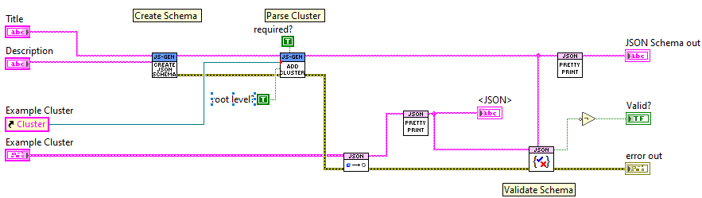
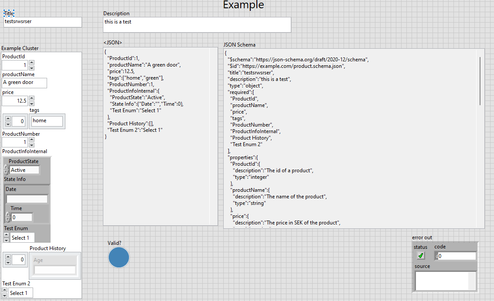

# LabVIEW JSON-Schema-Generator

[JSON Schema](https://json-schema.org/) is vocabulary which allows the definition of rules on how JSON data should be structured and validated. This allows for data consistancy, validation and interoperability between applications and languages. 

The LabVIEW JSON-Schema-Generator aims to extend the excellent JSONtext library by Dr. Powel by providing methods to generate a JSON Schema based of LabVIEW datatypes. The JSONtext library provides all common operations to handle JSON data as well as a validator against a JSON Schema. 

The current code base was developed based on internal requirements but has been open-sourced with the intention to develop a general tool to create JSON Schemas with LabVIEW.


Example:





## Scope

State: Work in Progress

The current implementation has the asumption that the root level of the JSON Schema is generated based on a cluster. Differnet properties of an control in the cluster are added to the Schema. Standard are the name and the description of a control. 

Supported data types:
- Clusters
  - with recursitve parsing
  - typedef support
- Arrays
  - cluster support
  - `#todo` add typedef support
- Strings
  - support for `minLength` and `maxLength` keywords via Description field. Use to add length validation to the string. `"minLength": 1` would mean that a string needs to have a value.
- Enums
  - typedef support
- Booleans 
- Numerics
  - support for `minimum`and `maximum` keywords


  - support for  `exclusiveMinium` and `exclusiveMaximum` keywords
  - support for `multipleOf` of keyoword to specify the steps size of the value

  ```
  x ≥ minimum
  x > exclusiveMinimum
  x ≤ maximum
  x < exclusiveMaximum
  ```


If a control in the cluster is a typedef it will also get parsed and added to the Schema via `$ref` tags to the `$def` section of the schema. This allow for the reuse within a schema. 

Some data types support additional keywords to further specify their evaluation.
These additional keywords are added via the "Description" property of the corresponding control in LabVIEW. Then the description is replaced with a JSON object. 

#### Example:
```
{
  "description": "This is a String Control",
  "minLength": 5,
  "maxLength": 20
}
```

## Development
The library is currently developed in Labview 2023 (64bit).

Required VIPM packages: see required-packages.vipc